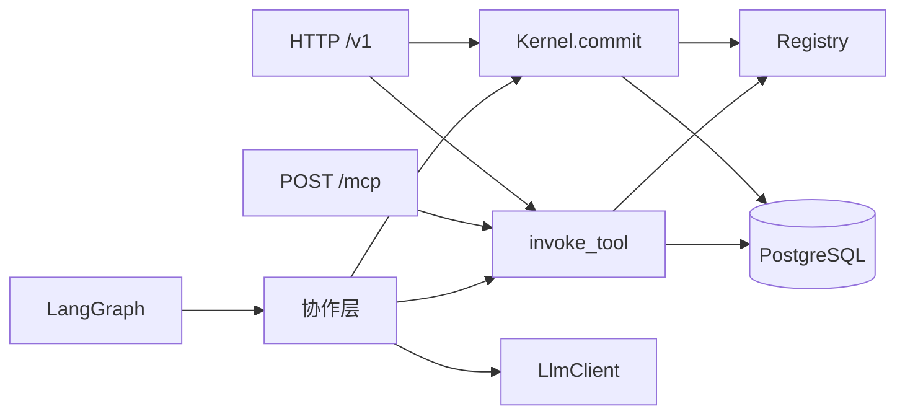
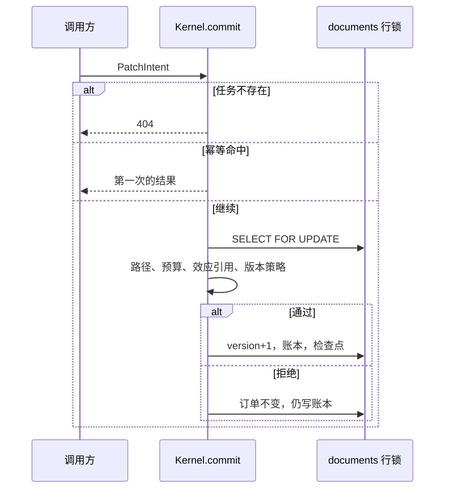
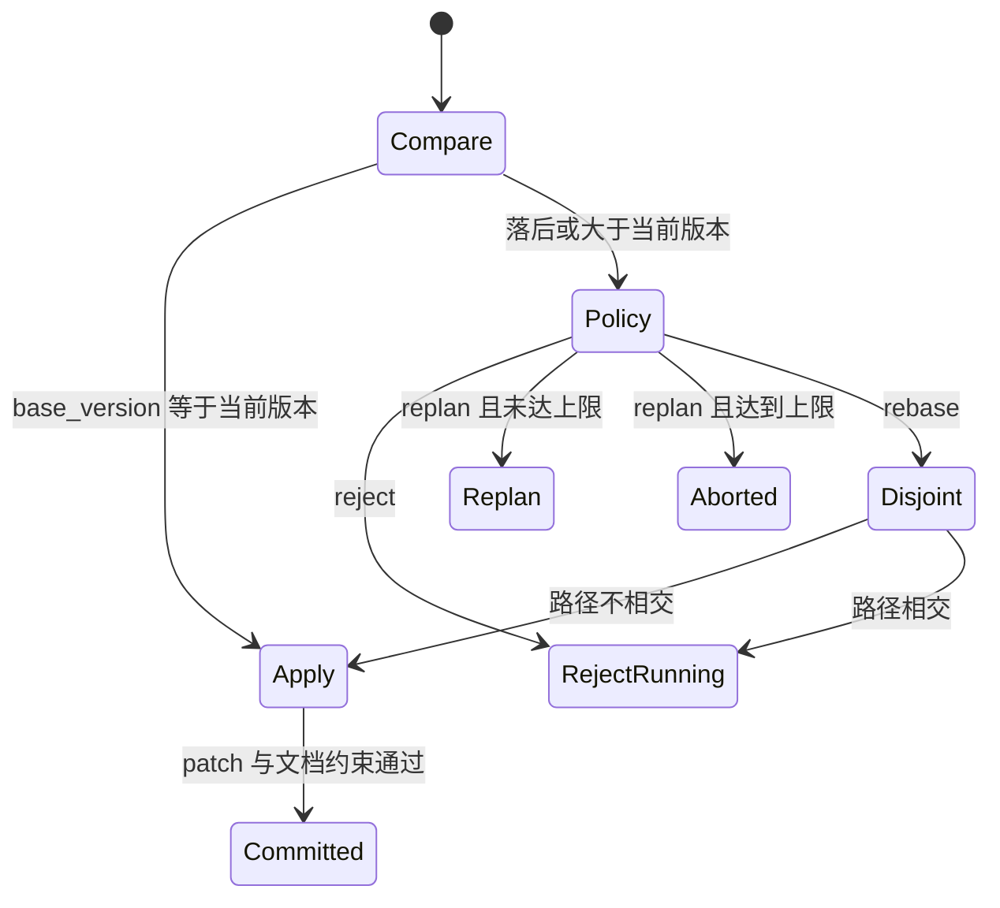
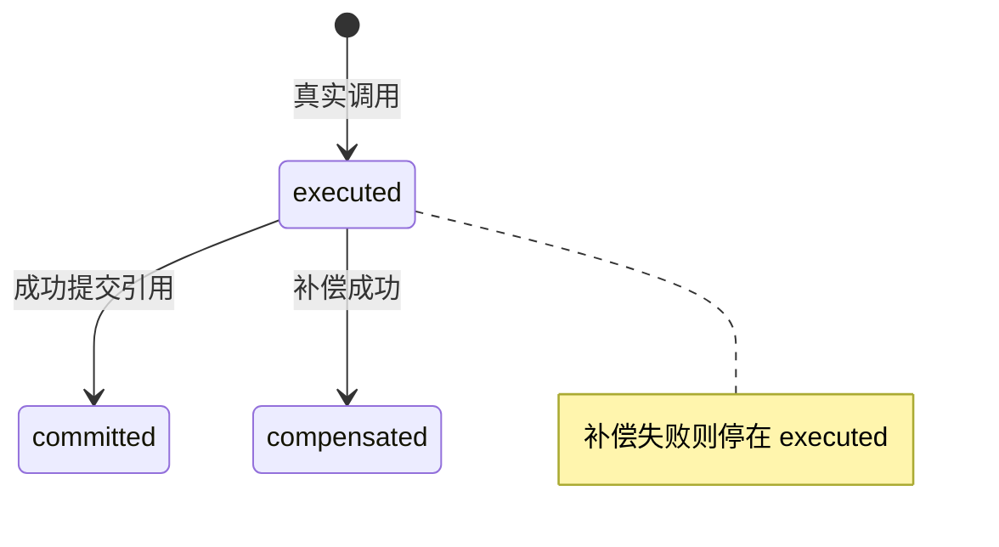

# ACCK 架构

## 目的

用图看清进程里有哪些部件，以及提交、冲突、效应、重放如何衔接。

## 读者

读实现之前需要先看结构的人。

## 范围

图表达的是 `docs/FEATURES.md` 与 `docs/DATABASE.md` 里已经定下的路径。不另画 Kubernetes。

## 内容

HTTP、MCP、LangGraph 和协作层进入同一个进程。注册表在内存里。订单只有 `Kernel.commit` 能按 11 步写入。协作层调用模型，再调用提交或工具。`no_kernel` 不经过 `Kernel.commit`。

提交时先处理结构、任务状态和幂等，再锁住订单行。预算和效应引用在版本策略之前。文档约束在应用 patch 之后。

写类工具才进入效应状态。`READ` 只写轨迹。

`LIVE` 写轨迹。`STRICT` 只比较 `input_hash`，第一处不等即停，不改订单。`RESUME` 从最大检查点继续，并删掉该游标之后的轨迹。检查顺序的理由在 `docs/ADR/002-gate-order.md`。
